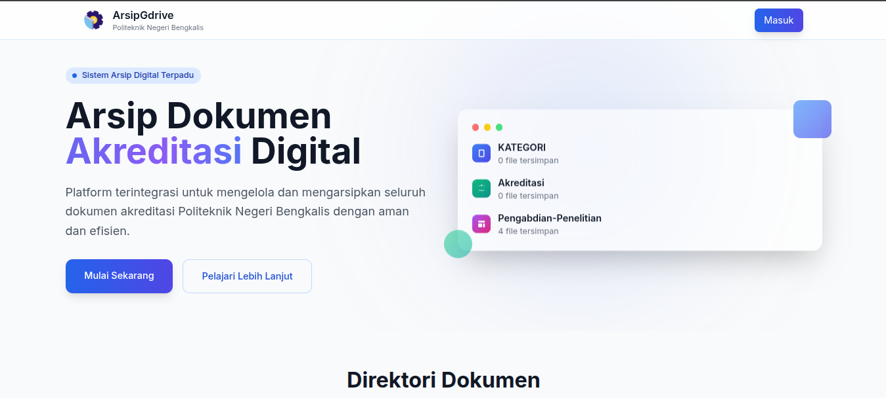

<h1 align="center">ArsipDrive - Sistem Arsip Digital Polbeng</h1>

Platform terintegrasi untuk mengelola dan mengarsipkan seluruh dokumen akreditasi Politeknik Negeri Bengkalis dengan aman dan efisien.

📖 Tentang Aplikasi
ArsipDrive adalah sebuah platform aplikasi web yang dirancang khusus untuk menjawab kebutuhan manajemen dokumen di lingkungan Politeknik Negeri Bengkalis. Aplikasi ini memfasilitasi proses pengarsipan, pengelolaan, dan penelusuran dokumen-dokumen penting, terutama yang berkaitan dengan proses akreditasi.

Dibangun dengan Laravel, aplikasi ini menawarkan sintaks yang elegan dan ekspresif, dengan fokus pada pengalaman pengembangan yang menyenangkan dan kreatif. Tujuannya adalah untuk menyederhanakan tugas-tugas kompleks dalam pengelolaan arsip digital berskala institusi.

✨ Fitur Utama
Aplikasi ini dilengkapi dengan berbagai fitur untuk menunjang kebutuhan manajemen arsip digital:

🗂️ Manajemen Folder Hirarkis: Admin dapat membuat struktur folder induk dan subfolder yang dinamis untuk mengorganisir dokumen berdasarkan kategori, standar, atau kebutuhan lainnya.

☁️ Integrasi Penuh dengan Google Drive: Seluruh file dan folder secara fisik disimpan di Google Drive, sementara database aplikasi mengelola metadata, izin, dan strukturnya. Pembuatan, pembaruan nama, dan penghapusan folder tersinkronisasi secara otomatis.

👥 Sistem Multi-User (Admin & Dosen): Terdapat dua peran utama:

Admin: Memiliki kontrol penuh atas struktur folder, manajemen pengguna (dosen), dan verifikasi dokumen.

Dosen: Dapat mengunggah dan mengelola dokumen di dalam folder yang telah ditugaskan kepadanya.

🔐 Isolasi Data yang Aman: Setiap dosen hanya dapat melihat dan mengelola folder serta dokumen miliknya sendiri, memastikan privasi dan keamanan data.

📊 Dasbor Admin Terpusat: Antarmuka khusus untuk admin guna membuat "Master Folder" yang secara otomatis ditugaskan ke semua dosen, menugaskan ulang folder, dan memonitor status dokumen.

🌍 Direktori Dokumen Publik: Halaman utama yang dapat diakses publik untuk menelusuri hierarki folder dan melihat daftar dokumen yang tersedia, tanpa bisa mengunduh file sensitif.

✅ Sistem Verifikasi Dokumen: Admin dapat menandai dokumen sebagai "Terverifikasi", memberikan status validitas pada arsip yang diunggah.

🚀 Teknologi yang Digunakan
Backend: PHP, Laravel Framework

Frontend: HTML, Tailwind CSS, JavaScript

Database: PostgreSQL (atau database relasional lain yang didukung Laravel)

API Eksternal: Google Drive API

📄 Lisensi
Aplikasi ini merupakan perangkat lunak sumber terbuka yang dilisensikan di bawah Lisensi MIT.
